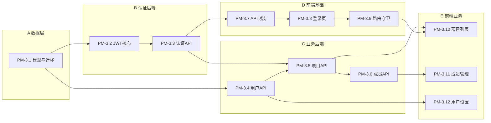

# PM-3 子任务拆解（Linear Issue 列表）

## 背景

**父任务：** PM-3 — Phase 1: 实现用户认证（JWT）、项目管理、项目成员模块

**当前基线（PM-2 已完成）：**
- 后端：[`backend/app/main.py`](backend/app/main.py) 仅有 health 路由；[`backend/app/core/database.py`](backend/app/core/database.py) 已就绪
- 前端：[`frontend/src/router/index.ts`](frontend/src/router/index.ts) 仅 `/` 首页
- 依赖：需新增 `python-jose`、`passlib[bcrypt]` 等（[`backend/requirements.txt`](backend/requirements.txt) 尚无 JWT 相关包）

**目标数据表（来自规划）：** `users`、`projects`、`project_members`

---

## 子任务列表（建议 Linear Issue 标题与内容）

### PM-3.1 数据库模型与 Alembic 迁移

**标题：** `[PM-3.1] users / projects / project_members 表结构与迁移`

**范围：**
- 新建 [`backend/app/models/user.py`](backend/app/models/user.py)、`project.py`、`project_member.py`
- Alembic 迁移 `002_foundation.py`

**表设计要点：**

| 表 | 核心字段 |
|----|----------|
| `users` | id, username(唯一), password_hash, display_name, role(enum: pm/dev/test), status(active/inactive), created_at |
| `projects` | id, name, description, owner_id(FK users), status, created_at |
| `project_members` | id, project_id, user_id, role(enum: owner/member), unique(project_id, user_id) |

**验收标准：**
- `alembic upgrade head` 在 `agile_pm` 库成功
- 三张表及外键、唯一约束正确
- 可用 SQL 或 `/docs` 暂不依赖（纯迁移验收）

**依赖：** 无（PM-2 已完成）

**建议分支：** `pm-3-1-models`

---

### PM-3.2 JWT 与安全基础设施

**标题：** `[PM-3.2] JWT 签发/校验与密码哈希`

**范围：**
- 新增 [`backend/app/core/security.py`](backend/app/core/security.py)：`hash_password`、`verify_password`、`create_access_token`、`decode_token`
- 新增 [`backend/app/core/deps.py`](backend/app/core/deps.py)：`get_current_user` 依赖
- 扩展 [`backend/app/core/config.py`](backend/app/core/config.py)：`jwt_secret`、`jwt_expire_minutes`
- 更新 [`backend/.env.example`](backend/.env.example) 与 `requirements.txt`（`python-jose[cryptography]`、`passlib[bcrypt]`）

**验收标准：**
- 单元级：密码 hash/verify 通过；token 签发后可 decode 出 `sub`
- 无效/过期 token 抛出 401

**依赖：** PM-3.1

**建议分支：** `pm-3-2-jwt-core`

---

### PM-3.3 认证 API（登录 / 当前用户）

**标题：** `[PM-3.3] POST /api/auth/login 与 GET /api/auth/me`

**范围：**
- 新建 [`backend/app/routers/auth.py`](backend/app/routers/auth.py)
- 新建 [`backend/app/schemas/auth.py`](backend/app/schemas/auth.py)
- 注册到 [`backend/app/main.py`](backend/app/main.py)

**API：**

| 方法 | 路径 | 说明 |
|------|------|------|
| POST | `/api/auth/login` | 用户名+密码 → `{ access_token, token_type }` |
| GET | `/api/auth/me` | 需 Bearer Token → 当前用户信息 |

**验收标准：**
- Swagger `/docs` 可登录并调用 `/me`
- 错误密码返回 401；inactive 用户拒绝登录

**依赖：** PM-3.1、PM-3.2

**建议分支：** `pm-3-3-auth-api`

---

### PM-3.4 用户管理 API

**标题：** `[PM-3.4] 用户 CRUD API（供成员分配使用）`

**范围：**
- 新建 [`backend/app/routers/users.py`](backend/app/routers/users.py)
- 新建 [`backend/app/schemas/user.py`](backend/app/schemas/user.py)
- 新建 [`backend/app/services/user_service.py`](backend/app/services/user_service.py)

**API：**

| 方法 | 路径 | 说明 |
|------|------|------|
| GET | `/api/users` | 列表（分页可选，支持 status 筛选） |
| POST | `/api/users` | 创建用户（管理员或 bootstrap 场景） |
| GET | `/api/users/{id}` | 详情 |
| PUT | `/api/users/{id}` | 更新 display_name / role / status |
| PATCH | `/api/users/{id}/password` | 修改密码 |

**验收标准：**
- 需登录才可访问
- 创建用户后可用新账号登录
- username 重复返回 409

**依赖：** PM-3.1、PM-3.3

**建议分支：** `pm-3-4-users-api`

---

### PM-3.5 项目管理 API

**标题：** `[PM-3.5] 项目 CRUD API`

**范围：**
- 新建 [`backend/app/routers/projects.py`](backend/app/routers/projects.py)
- 新建 [`backend/app/schemas/project.py`](backend/app/schemas/project.py)
- 新建 [`backend/app/services/project_service.py`](backend/app/services/project_service.py)

**API：**

| 方法 | 路径 | 说明 |
|------|------|------|
| GET | `/api/projects` | 当前用户可见项目（自己创建或身为成员） |
| POST | `/api/projects` | 创建项目，创建者自动成为 owner |
| GET | `/api/projects/{id}` | 详情 |
| PUT | `/api/projects/{id}` | 更新 name / description |
| DELETE | `/api/projects/{id}` | 软删或硬删（二选一，文档注明） |

**验收标准：**
- 非成员访问他人项目返回 403
- 创建项目后 `project_members` 自动插入 owner 记录

**依赖：** PM-3.1、PM-3.3、PM-3.4

**建议分支：** `pm-3-5-projects-api`

---

### PM-3.6 项目成员 API

**标题：** `[PM-3.6] 项目成员增删查 API`

**范围：**
- 在 `projects` 路由下或独立 [`backend/app/routers/project_members.py`](backend/app/routers/project_members.py)
- 权限：仅 project owner 可增删成员

**API：**

| 方法 | 路径 | 说明 |
|------|------|------|
| GET | `/api/projects/{id}/members` | 成员列表（含 user 基本信息） |
| POST | `/api/projects/{id}/members` | 添加成员 `{ user_id, role }` |
| DELETE | `/api/projects/{id}/members/{user_id}` | 移除成员 |

**验收标准：**
- owner 不可被移除（或需转让 owner 后再移除）
- 重复添加同一用户返回 409
- 普通 member 无法添加/删除他人

**依赖：** PM-3.5

**建议分支：** `pm-3-6-members-api`

---

### PM-3.7 前端 API 层与 Token 管理

**标题：** `[PM-3.7] Axios 拦截器与 Token 持久化`

**范围：**
- 扩展 [`frontend/src/api/index.ts`](frontend/src/api/index.ts)
- 新建 `frontend/src/api/auth.ts`、`frontend/src/stores/auth.ts`（Pinia）
- localStorage 存 `access_token`；请求头自动带 `Authorization`

**验收标准：**
- 登录后 token 写入 store + localStorage
- 401 响应自动跳转 `/login` 并清 token
- 刷新页面后 `/me` 可恢复登录态

**依赖：** PM-3.3（后端 auth API 可用）

**建议分支：** `pm-3-7-fe-api-auth`

---

### PM-3.8 登录页

**标题：** `[PM-3.8] /login 登录页面`

**范围：**
- 新建 [`frontend/src/views/LoginView.vue`](frontend/src/views/LoginView.vue)
- 注册路由 `/login`（[`frontend/src/router/index.ts`](frontend/src/router/index.ts)）
- Element Plus 表单：用户名、密码、登录按钮、错误提示

**验收标准：**
- 正确凭证登录后跳转 `/projects`
- 错误凭证显示友好错误信息
- 已登录用户访问 `/login` 重定向到 `/projects`

**依赖：** PM-3.7

**建议分支：** `pm-3-8-login-page`

---

### PM-3.9 路由守卫与布局框架

**标题：** `[PM-3.9] 路由守卫 + 带登出的 App 布局`

**范围：**
- 改造 [`frontend/src/App.vue`](frontend/src/App.vue)：顶栏显示当前用户、退出按钮
- router `beforeEach`：未登录访问受保护路由 → `/login`
- 受保护路由前缀：`/projects`、`/settings`

**验收标准：**
- 未登录直接访问 `/projects` 被拦截
- 点击退出清 token 并回登录页
- 布局与现有 Element Plus 风格一致

**依赖：** PM-3.7、PM-3.8

**建议分支：** `pm-3-9-route-guard`

---

### PM-3.10 项目列表页

**标题：** `[PM-3.10] /projects 项目列表与创建`

**范围：**
- 新建 [`frontend/src/views/ProjectListView.vue`](frontend/src/views/ProjectListView.vue)
- 新建 `frontend/src/api/projects.ts`
- 功能：列表展示、新建项目弹窗、进入项目详情

**验收标准：**
- 展示当前用户可见项目
- 新建成功后列表刷新
- 空状态有引导文案

**依赖：** PM-3.5、PM-3.9

**建议分支：** `pm-3-10-project-list`

---

### PM-3.11 项目成员管理 UI

**标题：** `[PM-3.11] 项目详情 - 成员管理 Tab`

**范围：**
- 新建 [`frontend/src/views/ProjectDetailView.vue`](frontend/src/views/ProjectDetailView.vue)（首版仅成员 Tab）
- 路由 `/projects/:id` 或 `/projects/:id/members`
- 成员列表、添加成员（用户下拉）、移除成员

**验收标准：**
- owner 可见添加/删除操作；普通 member 只读
- 操作成功后列表即时更新
- 与 PM-3.6 API 联调通过

**依赖：** PM-3.6、PM-3.10

**建议分支：** `pm-3-11-members-ui`

---

### PM-3.12 用户管理页（Settings）

**标题：** `[PM-3.12] /settings/users 用户管理页`

**范围：**
- 新建 [`frontend/src/views/UserListView.vue`](frontend/src/views/UserListView.vue)
- 路由 `/settings/users`
- 功能：用户列表、新建用户、编辑角色/状态

**验收标准：**
- 与 PM-3.4 API 完整联调
- PM 角色可管理用户（或首版所有登录用户可管理，规则写进 README）
- 表单校验：username 必填、密码长度限制

**依赖：** PM-3.4、PM-3.9

**建议分支：** `pm-3-12-users-ui`

---

## 可选附加 Issue（不阻塞 PM-3 关闭）

| Issue | 说明 |
|-------|------|
| PM-3.x Seed 脚本 | `backend/scripts/seed_admin.py` 创建初始 admin 用户，便于首次登录 |
| PM-3.x 集成测试 | pytest：`login → create project → add member` 链路 |

---

## Linear 创建建议

1. **父 Issue：** 保留 PM-3 为 Epic/父任务，上述 12 项设为 **Sub-issue** 或独立 Issue 并 `relatedTo: PM-3`
2. **Label：** `plan-sync`、`phase-1`、`backend` / `frontend`
3. **顺序：** 严格按 PM-3.1 → … → PM-3.12 推进；PM-3.7 可与 PM-3.4~3.6 后端并行（需 PM-3.3 先完成）
4. **状态：** 全部创建为 **Todo**；开始开发时说「开始做 PM-3.x」按口语 Rule 更新

---

## 完成 PM-3 的 Definition of Done

- 用户可通过登录页获取 JWT，刷新页面保持登录
- 可创建/查看/编辑项目，且仅成员可访问
- 项目 owner 可添加/移除成员
- 可在设置页管理用户（创建、改角色/状态）
- 后端 API 在 `/docs` 可完整演示；前端核心路径手动测试通过
- 代码合并 `main`，PM-3 标记 **Done**
