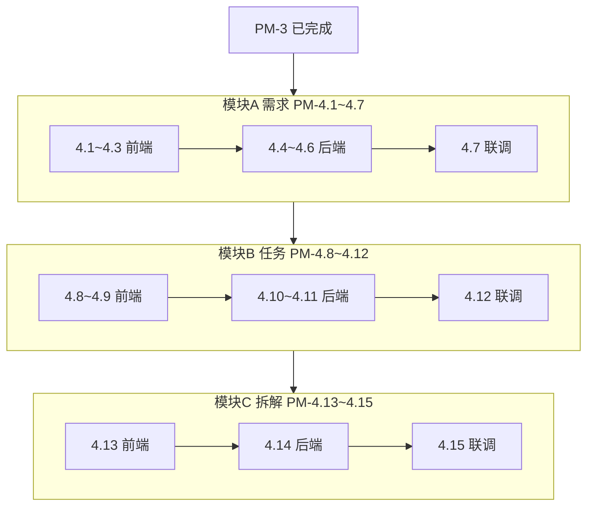

# PM-4 子任务拆解（Linear Issue 列表）

## 背景

**父任务：** [PM-4](https://linear.app/congchen/issue/PM-4) — Phase 2: 实现需求管理模块（分类、CRUD、取消、拆解为任务）

**上游依赖：** PM-3 已完成（JWT、项目/成员、Admin 布局、路由守卫）

**开发策略：** **按模块推进**（A 需求 → B 任务 → C 拆解）；每个模块内 **前端 Mock → 后端 API → 联调** 完成后再进入下一模块。

| 节奏 | 说明 |
|------|------|
| 模块顺序 | 模块 A → 模块 B → 模块 C |
| 模块内顺序 | 前端 → 后端 → 联调 |
| 模块完成标准 | 联调通过、Mock 关闭、真实 API 可演示 |

**当前基线：**
- 后端：[`backend/app/models/project.py`](backend/app/models/project.py)、[`backend/app/routers/projects.py`](backend/app/routers/projects.py)
- 前端：[`frontend/src/layouts/AdminLayout.vue`](frontend/src/layouts/AdminLayout.vue)、项目详情页
- **尚无** `requirements` / `tasks` 模型与路由

**目标数据表：** `requirements`、`tasks`（PM-6 再扩展看板/工时/状态流转）



---

## 层级与业务规则（全局）

### 需求树（`requirements.parent_id`）

- **多层嵌套**，任意深度；`GET ?tree=true` 返回嵌套树
- 任意节点可「添加子需求」；子需求默认继承直接父节点的 `type`
- **环校验**：不可将自身或子孙设为 `parent_id` → 400
- 取消父需求 **不级联** 子孙；UI 提示子树状态
- **仅末节点**（无子需求）可「拆解为任务」

### 任务树（`tasks.parent_id`）

- **多层嵌套**，任意深度
- 拆解弹窗支持递归 `subtasks[]`；也可手动 `POST /tasks` 加子任务
- 子任务继承直接父任务的 `requirement_id`、`project_id`
- **环校验**同需求；取消父任务不级联

### 末节点定义

不存在 `parent_id = 当前需求 id` 的子需求记录。若末节点后续新增子需求，则不可再拆解（已有任务保留）。

---

## 子任务列表

---

## 模块 A：需求管理

### PM-4.1 需求 types + Mock API

**标题：** `[PM-4.1] 需求 types 与 Mock API`

**范围：**
- 新建 [`frontend/src/api/types/requirement.ts`](frontend/src/api/types/requirement.ts)（含 `parent_id`、`children?`）
- 新建 `frontend/src/api/mock/requirements.ts`（至少 3 层嵌套 mock 树）
- 新建 [`frontend/src/api/requirements.ts`](frontend/src/api/requirements.ts)（Mock 实现，`USE_MOCK` 开关）

**验收标准：**
- TypeScript 类型覆盖 CRUD、tree、cancel 请求/响应
- Mock 可返回 core/non_core 混合多级树

**依赖：** PM-3

**建议分支：** `pm-4-1-req-types-mock`

---

### PM-4.2 需求多级树列表页

**标题：** `[PM-4.2] /projects/:id/requirements 多级树列表`

**范围：**
- 新建 [`frontend/src/views/RequirementListView.vue`](frontend/src/views/RequirementListView.vue)
- 注册路由 `/projects/:id/requirements`（AdminLayout 子路由）
- 核心/非核心 Tab；el-table tree 或多级 Tree 展开

**验收标准：**
- Mock 数据下 Tab 切换、树展开/折叠正常
- 点击节点可打开详情抽屉（与 4.3 联调）

**依赖：** PM-4.1

**建议分支：** `pm-4-2-req-list`

---

### PM-4.3 需求详情抽屉

**标题：** `[PM-4.3] 需求详情抽屉（CRUD / 子需求 / 拆解入口）`

**范围：**
- 需求详情抽屉：创建、编辑、取消（含 cancel_reason）
- 任意节点「添加子需求」
- **末节点**显示「拆解为任务」入口（C 模块前可仅占位）

**验收标准：**
- Mock 下 CRUD、添加子需求、取消表单校验通过
- 有子需求的节点不显示拆解入口

**依赖：** PM-4.2

**建议分支：** `pm-4-3-req-drawer`

---

### PM-4.4 requirements 模型与迁移

**标题：** `[PM-4.4] requirements 表结构与 Alembic 迁移`

**范围：**
- 新建 [`backend/app/models/requirement.py`](backend/app/models/requirement.py)
- Alembic 迁移 `003_requirements.py`（或与 4.10 合并为 `003_requirements_tasks.py`）

**表字段：**

```
id, project_id, parent_id (FK requirements.id),
title, description, type (core|non_core), priority,
status (draft|active|done|cancelled),
owner_id, cancelled_at, cancel_reason,
created_at, updated_at
```

**验收标准：**
- `alembic upgrade head` 成功
- `parent_id` 自关联索引正确

**依赖：** PM-3；**模块 A 前端 4.1~4.3 完成后**启动

**建议分支：** `pm-4-4-req-model`

---

### PM-4.5 需求 CRUD + tree API

**标题：** `[PM-4.5] 需求 CRUD 与 tree 列表 API`

**范围：**
- 新建 `backend/app/schemas/requirement.py`、`services/requirement_service.py`
- 新建 [`backend/app/routers/requirements.py`](backend/app/routers/requirements.py)（挂到 projects 下或独立注册）
- `GET/POST /projects/{id}/requirements`、`GET/PUT /{rid}`、`GET ?tree=true&type=`
- `parent_id` 环校验

**验收标准：**
- 项目成员 CRUD；非成员 403
- `tree=true` 返回完整多级树；成环 400

**依赖：** PM-4.4

**建议分支：** `pm-4-5-req-api`

---

### PM-4.6 需求取消 API

**标题：** `[PM-4.6] PATCH 取消需求 API`

**范围：**
- `PATCH /projects/{id}/requirements/{rid}/cancel`（body: `cancel_reason`）
- 不级联取消子孙需求

**验收标准：**
- 取消后 `status=cancelled`，记录 `cancelled_at`、`cancel_reason`
- 子孙需求 status 不变

**依赖：** PM-4.5

**建议分支：** `pm-4-6-req-cancel`

---

### PM-4.7 需求模块联调

**标题：** `[PM-4.7] 需求模块前后端联调`

**范围：**
- 关闭需求模块 `USE_MOCK`
- 列表/抽屉/子需求/取消/环校验全链路

**验收标准：**
- 前端全部走真实 API
- 模块 A Definition of Done 满足

**依赖：** PM-4.3、PM-4.6

**建议分支：** `pm-4-7-req-integration`

---

## 模块 B：任务基础

### PM-4.8 任务 types + Mock API

**标题：** `[PM-4.8] 任务 types 与 Mock API`

**范围：**
- 新建 [`frontend/src/api/types/task.ts`](frontend/src/api/types/task.ts)（含递归 `subtasks?`、`children?`）
- Mock 多层任务树
- 新建 [`frontend/src/api/tasks.ts`](frontend/src/api/tasks.ts)（Mock）

**验收标准：**
- 类型与 decompose 请求体对齐
- Mock 至少 3 层任务树

**依赖：** PM-4.7

**建议分支：** `pm-4-8-task-types-mock`

---

### PM-4.9 关联任务多级树 UI

**标题：** `[PM-4.9] 需求详情 - 关联任务多级树`

**范围：**
- 在需求详情抽屉内嵌入「关联任务」多级树组件
- 支持展开/折叠；Mock 数据驱动

**验收标准：**
- 按 `requirement_id` 展示该末节点下任务树
- 可手动添加子任务（Mock）

**依赖：** PM-4.8、PM-4.3

**建议分支：** `pm-4-9-task-tree-ui`

---

### PM-4.10 tasks 模型与迁移

**标题：** `[PM-4.10] tasks 表结构与 Alembic 迁移`

**范围：**
- 新建 [`backend/app/models/task.py`](backend/app/models/task.py)
- 迁移（可与 4.4 合并）

**表字段：**

```
id, project_id, requirement_id, parent_id (FK tasks.id),
title, description, source_type, source_description,
status, assignee_id, planned_hours, actual_hours,
created_at, updated_at
```

**验收标准：**
- 迁移成功；`parent_id` 自关联正确

**依赖：** PM-4.7

**建议分支：** `pm-4-10-task-model`

---

### PM-4.11 任务 CRUD + tree API

**标题：** `[PM-4.11] 任务 CRUD 与 tree 列表 API`

**范围：**
- 新建 `schemas/task.py`、`services/task_service.py`、路由
- `GET/POST /projects/{id}/tasks`；`?requirement_id=`、`?tree=true`
- `parent_id` 环校验

**验收标准：**
- 可按 requirement 查任务树
- 独立创建 adhoc/internal/external 来源任务

**依赖：** PM-4.10

**建议分支：** `pm-4-11-task-api`

---

### PM-4.12 任务模块联调

**标题：** `[PM-4.12] 任务模块前后端联调`

**范围：**
- 关闭任务模块 Mock
- 关联任务树 + 手动添加子任务走真实 API

**验收标准：**
- 模块 B Definition of Done 满足

**依赖：** PM-4.9、PM-4.11

**建议分支：** `pm-4-12-task-integration`

---

## 模块 C：需求拆解为任务

### PM-4.13 拆解为任务弹窗 UI

**标题：** `[PM-4.13] 拆解为任务弹窗（递归任务树编辑器）`

**范围：**
- 末节点打开弹窗；非末节点禁用 + Tooltip
- 动态增删顶层任务行与递归 subtasks 行
- Mock 提交后刷新关联任务树

**验收标准：**
- 可编辑至少 3 层任务结构
- 有子需求的需求节点无法打开拆解

**依赖：** PM-4.12

**建议分支：** `pm-4-13-decompose-ui`

---

### PM-4.14 decompose API

**标题：** `[PM-4.14] POST decompose 拆解 API`

**范围：**
- `POST /api/projects/{pid}/requirements/{rid}/decompose`
- 递归创建任务树；校验：已取消 / **非末节点** → 400
- 注册到 [`backend/app/main.py`](backend/app/main.py)

**请求体：**

```json
{
  "tasks": [{
    "title": "...",
    "subtasks": [{ "title": "...", "subtasks": [] }]
  }]
}
```

**验收标准：**
- 末节点一次请求创建完整任务树
- 非末节点、已取消需求返回 400
- 任务 `source_type=requirement`，`requirement_id=rid`

**依赖：** PM-4.11

**建议分支：** `pm-4-14-decompose-api`

---

### PM-4.15 拆解模块联调

**标题：** `[PM-4.15] 拆解模块前后端联调`

**范围：**
- 拆解弹窗接真实 decompose API
- 拆解后任务树即时刷新

**验收标准：**
- 末节点拆解 → 任务树更新
- 模块 C / PM-4 整体 Definition of Done 满足

**依赖：** PM-4.13、PM-4.14

**建议分支：** `pm-4-15-decompose-integration`

---

## 实施顺序总览

| 顺序 | 编号 | 模块 | 阶段 |
|------|------|------|------|
| 1 | 4.1 | A | 前端 |
| 2 | 4.2 | A | 前端 |
| 3 | 4.3 | A | 前端 |
| 4 | 4.4 | A | 后端 |
| 5 | 4.5 | A | 后端 |
| 6 | 4.6 | A | 后端 |
| 7 | 4.7 | A | 联调 |
| 8 | 4.8 | B | 前端 |
| 9 | 4.9 | B | 前端 |
| 10 | 4.10 | B | 后端 |
| 11 | 4.11 | B | 后端 |
| 12 | 4.12 | B | 联调 |
| 13 | 4.13 | C | 前端 |
| 14 | 4.14 | C | 后端 |
| 15 | 4.15 | C | 联调 |

---

## PM-4 Definition of Done

- 项目内需求：分类 Tab、多级树、CRUD、取消、子需求
- 需求与任务：`parent_id` 多层嵌套 + 环校验
- **仅末节点需求**可拆解为多级任务树
- 需求详情展示关联任务多级树
- 权限与 PM-3 项目成员规则一致
- 全部 Mock 已替换；核心路径手动测试通过

---

## Linear 同步状态（已创建）

**父任务：** [PM-4](https://linear.app/congchen/issue/PM-4)

**Epic：**

| 计划编号 | Linear | 标题 |
|----------|--------|------|
| PM-4.A | [PM-22](https://linear.app/congchen/issue/PM-22) | 需求管理（分类、多级树、子需求、CRUD、取消） |
| PM-4.B | [PM-23](https://linear.app/congchen/issue/PM-23) | 任务基础（支撑拆解） |
| PM-4.C | [PM-24](https://linear.app/congchen/issue/PM-24) | 需求拆解为任务 |

**子任务对照表：**

| 计划编号 | Linear | 标题 |
|----------|--------|------|
| PM-4.1 | [PM-25](https://linear.app/congchen/issue/PM-25) | 需求 types 与 Mock API |
| PM-4.2 | [PM-27](https://linear.app/congchen/issue/PM-27) | /projects/:id/requirements 多级树列表 |
| PM-4.3 | [PM-28](https://linear.app/congchen/issue/PM-28) | 需求详情抽屉（CRUD / 子需求 / 拆解入口） |
| PM-4.4 | [PM-29](https://linear.app/congchen/issue/PM-29) | requirements 表结构与 Alembic 迁移 |
| PM-4.5 | [PM-26](https://linear.app/congchen/issue/PM-26) | 需求 CRUD 与 tree 列表 API |
| PM-4.6 | [PM-30](https://linear.app/congchen/issue/PM-30) | PATCH 取消需求 API |
| PM-4.7 | [PM-31](https://linear.app/congchen/issue/PM-31) | 需求模块前后端联调 |
| PM-4.8 | [PM-33](https://linear.app/congchen/issue/PM-33) | 任务 types 与 Mock API |
| PM-4.9 | [PM-34](https://linear.app/congchen/issue/PM-34) | 需求详情 - 关联任务多级树 |
| PM-4.10 | [PM-32](https://linear.app/congchen/issue/PM-32) | tasks 表结构与 Alembic 迁移 |
| PM-4.11 | [PM-35](https://linear.app/congchen/issue/PM-35) | 任务 CRUD 与 tree 列表 API |
| PM-4.12 | [PM-36](https://linear.app/congchen/issue/PM-36) | 任务模块前后端联调 |
| PM-4.13 | [PM-37](https://linear.app/congchen/issue/PM-37) | 拆解为任务弹窗（递归任务树编辑器） |
| PM-4.14 | [PM-39](https://linear.app/congchen/issue/PM-39) | POST decompose 拆解 API |
| PM-4.15 | [PM-38](https://linear.app/congchen/issue/PM-38) | 拆解模块前后端联调 |

---

## 与 PM-6 边界

| PM-4 包含 | PM-6 负责 |
|-----------|-----------|
| requirements / tasks 基础 CRUD + tree | 看板 UI、拖拽状态 |
| decompose 创建任务树 | 工时 PATCH、状态流转 |
| 末节点拆解 | 迭代归属、source 筛选页 |

---

## 开发口令

用户说「开始做 PM-4.x」时，按上表顺序执行；默认从 **PM-4.1** 开始。
